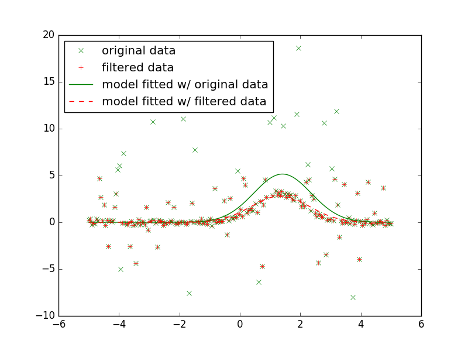

I'm very glad to say that I have been selected by the <a href="http://www.astropy.org/">Astropy</a> project to participate in the Google Summer of Code 2016, aka GSoC'16!!

Many thanks surely goes to Duília, Jandro, Marcelo, Moritz, Brigitta and Erik and to all who make the Astropy development community ;-)

During the GSoC (and after, for sure) I'm going to work for an Astropy affiliated package called <a href="https://github.com/astropy/photutils"><b>photutils</b></a>, which, among many other things, provides a set of tools for performing photometry of astronomical sources.

Fundamentally, my task will be the development of code for Point Spread Function (PSF) photometry of overlapped sources. There are several scenarios in which one would choose PSF photometry instead of Aperture photometry. Basically, Aperture photometry assumes that the background varies in a linear fashion in the aperture’s vicinity. However, in a dense star cluster the background is usually nonlinear. Therefore, one may use PSF photometry in order to meaningfully measure the brightnesses of the sources. In PSF photometry, a single model (usually Gaussian shaped) is fitted to each object allowing one to determine, with subpixel precision, its center position, amplitude, and width. The uncertainties<a href="#fn1" id="ref1">1</a> associated with each of these parameters may be determined as well.

However, this becomes a non straightforward task when considering fitting multiple overlapping objects. To do so, one can not "just fit a model with hundreds parameters". In fact, there exist several problems with this "brute force" approach, and the most critical one might be that the parameter space will have many dimensions (as many as the number of parameters, precisely), which almost certainly will make optimization algorithms to diverge or to get stuck in a local minima.

In summary, my primary task is to work on developing an algorithm to localize, fit, and perform photometry of several overlapping objects (e.g. a dense star cluster, globular clusters, etc) simultaneously.

And... I already have some kind of vague thoughts to share :)

Following an idea made by <a href="https://github.com/astropy/astropy/issues/4698">@pllim</a>, I started to write a new fitter for Astropy (which might have a chance to integrate my GSoC project). The idea stated by @pllim is very simple, but powerful: combine the sigma clip technique (to remove outliers) with a fitting procedure (a statistic to be minimized + an optmization algorithm) and iterate until some metric is attained (or the number of iterations is reached).

Then, basically following the Astropy development guidelines, I sketched a code and wrote a basic test for a class which I called FittingWithOutlierRemoval. As stated in the idea, this class combines an astropy fitting procedure with an outlier removal technique.

The following figure illustrate a glimpse of what one could do with the FittingWithOutlierRemoval.

  

As you could see, the green line is the model fitted the original data while the red line is the model fitted with a subset of the original data which was selected using sigma clip. Interestingly, I think this is what kind of happens (mentors do correct me here if I'm totally mistaken) when the light from bright stars (the outliers) "shadow" faint neighbours, so that a "common" fitting algorithm will incorrectly estimate (or even not detect) the position and the flux of the "faded" source.

But then, while writing this class and some examples, I discovered that Astropy fittings do not support masked arrays as input. So, I'm thinking on submitting an PR for that. Definitely, doing this, I'll continue to learn more about Astropy fittings and models, which surely is going to help me in design a robust API for my GSoC project.

Please, see my working in progress pull request <a href="https://github.com/astropy/astropy/pull/4760">#4760</a> for further details.

<i>Now... to work! :)</i>

1. In the future, I have to discuss uncertainties on parameter estimation with the mentors. See <a href="https://github.com/astropy/astropy/issues/1827">Issue #1827</a><a href="#ref1" title="Jump back to footnote 1 in the text.">↩</a>

