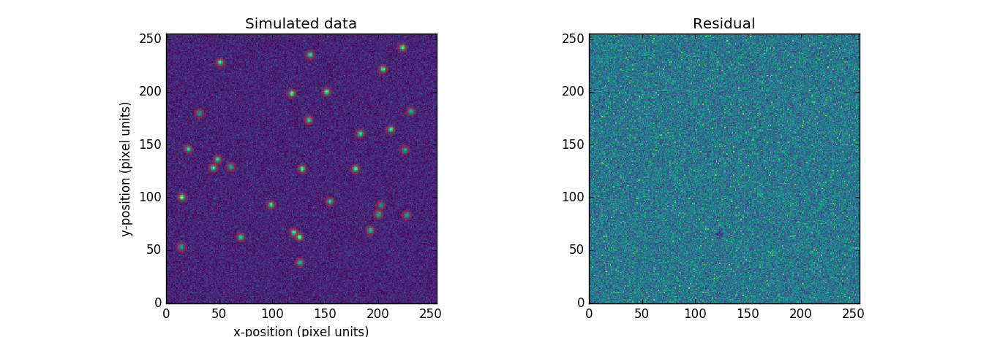

Second week of the community bonding period is over!

During that week, I primarily took a detailed reading of the classic Stetson's 1987 paper, which meticulously describes the algorithms implemented in the DAOPHOT software to perform point spread function photometry on crowded fields.

As stated in the previous post, psf photometry of overlapping sources is feasible with DAOPHOT through the loop FIND-GROUP-NSTAR-SUBTRACT-FIND-GROUP... until no more sources are found.

Right now, **photutils** already has FIND and SUBTRACT routines implemented.
So, I started by sketch an interface of the GROUP routine, which looks like this

```python
def daogroup(starlist, crit_separation=None):
    """
    This is an implementation that follows the DAOGROUP algorithm presented
    by Stetson (1987).

    GROUP divides an entire starlist into sets of distinct, self-contained
    groups of mutually overlapping stars.

    GROUP accepts as input a list of stars and their approximate
    brightenesses relative to a model stellar intensity profile for the frame
    and determines which stars are close enough to be capable of
    adversely influencing each others' profile fits.

    Parameters
    ----------
    starlist : `~astropy.Table` or array-like
        List of stars positions.
        If `~astropy.Table`, columns should be named 'x_0' and 'y_0'.
        Additionally, 'flux_0' may also be provided.
        If array-like, it should be either (x_0, y_0) or (x_0, y_0, flux_0).
        If 'starlist' only contains x_0 and y_0, 'crit_separation' must be
        provided.
    crit_separation : float (optional)
        Distance, in units of pixels, such that any two stars separated by
        less than this distance will be placed in the same group.
        If None, 'flux_0' must be provided in 'starlist'.

    Returns
    -------
    group_starlist : list of `~astropy.Table`
        Each `~astropy.Table` in the list corresponds to a group of mutually
        overlapping starts.

    Notes
    -----
    Assuming the psf fwhm to be known, 'crit_separation' may be set to
    k*fwhm, for some positive real k.

    See
    ---
    `~daofind`
    """

    """
    The GROUP algorithm, as described by Stetson, is as follows.

    Take the first star on `starlist`, then the rest of the list is searched
for stars lying within one critical separation of the star in question. If any
stars are found to lie within one critical separation, they are assigned to
its group. Otherwise, the star in question is isolated and may be fitted by a
single model.
    When the end of the star list has been reached, the stars remaining
unassigned are searched for any lying within the critical separation of the
second star in the group; if such are found, they are assigned to that group.
    This process is iterated until no star remains unassigned.

    Some comments on complexity:
        - For a given star, find all stars lying within one critical
        separation takes at most O(n).
        - For a given group, insert stars takes at most O(n).
    """
```

On the previous post I also commented about the uncertainties on fitted parameters. On this matter, I went ahead and opened this PR [#358](https://github.com/astropy/photutils/pull/358).

I also played a bit generating simulated data of isolated sources and using `psf_photometry` to fit them sequentially. The code that I wrote is as follows

```python
import numpy as np
from astropy.table import Table
from astropy.stats import sigma_clipped_stats
from photutils.datasets import make_random_gaussians
from photutils.datasets import make_noise_image
from photutils.datasets import make_gaussian_sources
from photutils import daofind
from photutils import psf
from photutils import CircularAperture
from matplotlib import rcParams
import matplotlib.pyplot as plt
from mpl_toolkits.mplot3d import Axes3D
rcParams['image.cmap'] = 'viridis'
rcParams['image.aspect'] = 1  # to get images with square pixels
rcParams['figure.figsize'] = (20,10)
rcParams['image.interpolation'] = 'none'

# generate artificial image
ground_truth = make_random_gaussians(30, [500, 1000], [8, 248], [8, 248],
                                     [2, 2], [2, 2], random_state=12345)
shape = (256, 256)
image = (make_gaussian_sources(shape, ground_truth) +
         make_noise_image(shape, type='poisson', mean=5., random_state=12345))

ground_truth.write('input.html')
# estimate background as the median after sigma clipping the sources
_, bkg, std = sigma_clipped_stats(image, sigma=3.0, iters=5)

# find potential sources with daofind
sources = daofind(image - bkg, threshold=5.0*std, fwhm=4.0)
intab = Table(names=['x_0', 'y_0', 'flux_0'], data=[sources['xcentroid'],
              sources['ycentroid'], sources['flux']])
apertures = CircularAperture((sources['xcentroid'], sources['ycentroid']),
                             r=4.)
# perform fitting
fit_info = ['param_cov']
psf_model = psf.IntegratedGaussianPRF(flux=1, sigma=2.0)
fitted_sources = psf.psf_photometry(image - bkg, intab, psf_model,
                                    fitshape=(8,8),
                                    fitter=fitting.LevMarLSQFitter(),
                                    param_uncert=True)
fitted_sources.write('output.html')
residual_image = psf.subtract_psf(image, psf_model, fitted_sources)

# plot results
plt.subplot(1, 2, 1)
plt.imshow(image, origin='lower', interpolation='nearest')
plt.title('Simulated data')
plt.xlabel('x-position (pixel units)')
plt.ylabel('y-position (pixel units)')
apertures.plot(color='red', lw=1.5, alpha=0.5)
plt.subplot(1, 2, 2)
plt.imshow(residual_image, origin='lower', interpolation='nearest')
plt.title('Residual')
plt.show()

print(fitted_sources)
```



For this third week I expect to refine the `daogroup` API and start a similar sketch for the NSTAR routine. Just to give a glimpse, NSTAR basically accepts as input the list of groups returned by GROUP and, for every group, it creates a compound PSF model which will be fittted to all stars within a given group.

*Now, to work*! :)
