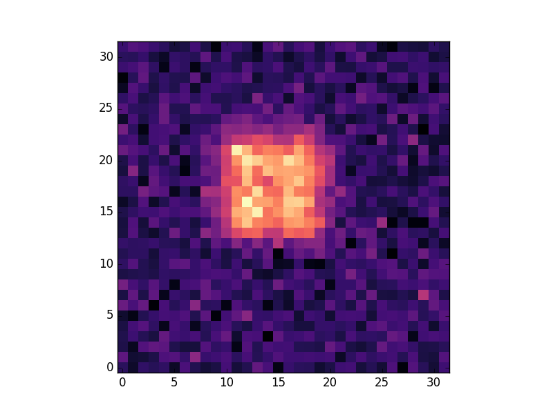

Hi all!

Finishing the NSTAR routine in <a href="https://github.com/astropy/photutils/pull/385">#385</a> was bigger than I thought, but with the suggestions from mentors to use <a href="http://docs.astropy.org/en/stable/api/astropy.nddata.utils.overlap_slices.html">overlap_slices</a>, I could write a clean solution.

More specifically, <u>overlap_slices</u> allows one to extract an smaller array from a bigger array while taking care of the correct behavior at the boundaries. Therefore, I'm able to extract the overlap sources without repeating the overlap parts (or extracting twice as I was doing before).

The following images illustrates an example of the use of <u>overlap_slices</u>.

  

  

Although, we have some things yet to decide and implement, I've started to write the documentation for the PSF Photometry. It's still on its infancy, but you can check it out on <a href="https://github.com/astropy/photutils/pull/385">#385</a>.

<i>Now, to work! :)</i>

