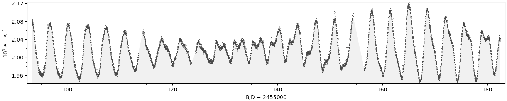
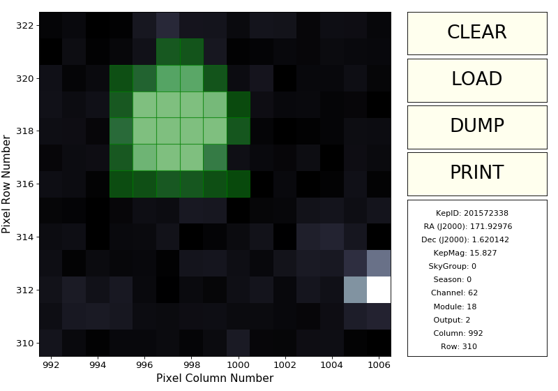
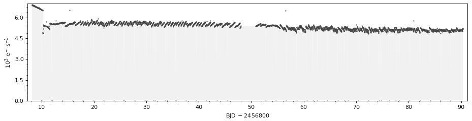
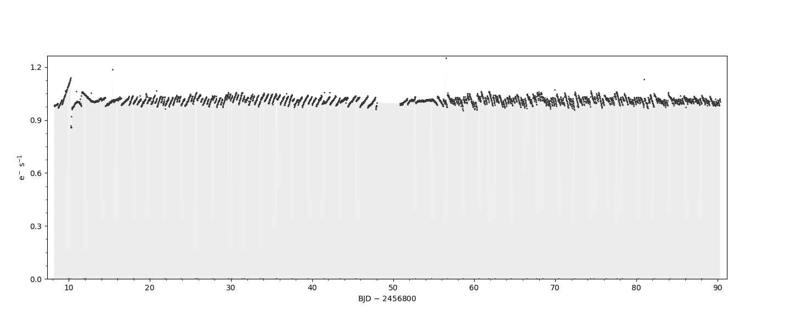
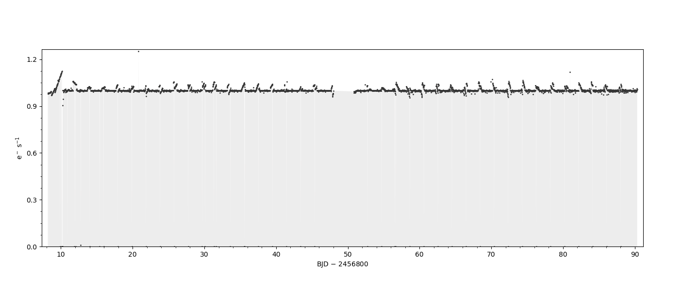

<p style='text-align: justify;'>
Hi everyone!
</p>

<p style='text-align: justify;'>
PyKE v3.0beta has been <a href="https://keplerscience.arc.nasa.gov/beta-release-of-pyke-v30-out-now.html">announced</a>!
</p>

<p style='text-align: justify;'>
Quite a few things have changed since PyKE v2.6.3, more precisely PyKE v3.0:
</p>

* does not depend on PyRAF anymore
* is installable using ``pip install pyketools``
* is being developed actively in a fully collaborative and open manner on <a href="https://www.github.com/KeplerGO/PyKE">GitHub</a>
* can be used as both command line tools or function calls
* is up to date with its dependencies (numpy, scipy, astropy, etc)

PyKE has been a very versatile package. For example, one can execute quick-look tasks
like plot a lightcurve with ``kepdraw``:

```python
In [1]: from pyke import kepdraw
In [2]: kepdraw("kplr005110407-2009350155506_llc.fits")
```

Or analogously,
```bash
$ kepdraw kplr005110407-2009350155506_llc.fits
```

<center></center>

To look and create an aperture mask (left-click on the pixels and hit "dump"), one can use ``kepmask``:

```python
In [3]: from pyke import kepmask
In [4]: kepmask("ktwo201572338-c01_lpd-targ.fits.gz")

      KepID:  201572338
 RA (J2000):  171.92976
Dec (J2000):  1.620142
     KepMag:  15.827
   SkyGroup:  0
     Season:  0
    Channel:  62
     Module:  18
     Output:  2
```

<center></center>

To extract a light curve using that specific mask, one can use ``kepextract``:

```python
In [5]: from pyke import kepextract, kepdraw
In [6]: kepextract("ktwo201572338-c01_lpd-targ.fits.gz", maskfile="mask.txt")
Writing output file ktwo201572338-c01_lpd-targ-kepextract.fits...
In [7]: kepdraw("ktwo201572338-c01_lpd-targ-kepextract.fits")
```

<center></center>

To remove low-frequency components from the above lightcurve, we can use ``kepflatten``:

```python
In [8]: from pyke import kepflatten
In [9]: kepflatten("ktwo201572338-c01_lpd-targ-kepextract.fits")
Writing output file ktwo201572338-c01_lpd-targ-kepextract-kepflatten.fits...
In [10]: kepdraw("ktwo201572338-c01_lpd-targ-kepextract-kepflatten.fits")
```

<center></center>

K2 data has correlated noise due to the motion of the spacecraft; this correlated noise
can be compensated with ``kepsff``:

```python
In [11]: from pyke import kepsff
In [12]: kepsff("ktwo201572338-c01_lpd-targ-kepextract-kepflatten.fits", stepsize=0.5)
Writing output file ktwo201572338-c01_lpd-targ-kepextract-kepflatten-kepsff.fits...
In [13]: kepdraw("ktwo201572338-c01_lpd-targ-kepextract-kepflatten-kepsff.fits")
```

<center></center>

Need to tweak the bits a little more to get a cleaner lightcurve =)

The full documentation of PyKE lives in <a href="https://pyke.keplerscience.org ">https://pyke.keplerscience.org</a>.

Feel free to contribute via GitHub issues or pull requests ;-)
