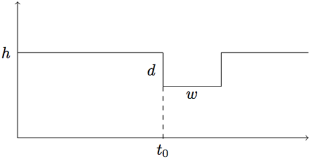

I'm interested in finding a fast way to compute good enough estimates of periods
of transit-like events caused by planets.

One of the prime works in this direction has been carried out by
<a href="https://arxiv.org/abs/astro-ph/0206099">Kovács, Zucker, and Mazeh</a>.
Their algorithm, the Box-least Squares (or BLS for short), has been very
successful in finding planets (their paper has over 500 citations!).

In this blog post, I follow a similar approach to derive the parameters
of a box function that "best" fits a planet transit in time series
brightness data of stars (these are often called "lightcurves" by astronomers).

Assume the following relation for the folded lightcurve $$\boldsymbol{y} \triangleq (y_1, y_2, ..., y_n)$$
\begin{align}
y_i = h - d\cdot \mathbb{I}(t_0 \leq t_i \leq t_0 + w) + \eta_i\nonumber,
\end{align}
where $$\eta_i \sim \mathcal{N}(0, \sigma^2)$$, $$\sigma$$ is known, and $$\mathbb{I}$$
is the indicator function. The parameters to be estimated are $$\left\{h, d, t_0, w\right\}$$,
i.e. the baseline flux $$h$$, the depth of the planet transit $$d$$,
the start time of the transit $$t_0$$, and the duration or width of the transit $$w$$.

Pictorially:

In this setting, $$y_i \sim \mathcal{N}(h - d\cdot \mathbb{I}(t_0 \leq t_i \leq t_0 + w), \sigma^2)$$,
and the joint probability density function of $$\boldsymbol{y}$$ is given by
$$
\begin{align} p(\boldsymbol{y}) = \prod_{i=1}^{n} p(y_i) = \dfrac{1}{(2\pi\sigma^2)^{n/2}} \exp\left\{-\dfrac{1}{2\sigma^2}\left(\sum_{i \in I^c}(y_i - h)^2 + \sum_{i \in I}(y_i - (h - d))^2\right)\right\}
\end{align}
$$
where $$I \triangleq \{i | t_0 \leq t_i \leq t_0 + w\}$$.

The log-likelihood function (up to an additive constant) may be written as
\begin{align}
    \log p(\boldsymbol{y}) = -\dfrac{1}{2\sigma^2}\left(\sum_{i \in I^c}(y_i - h)^2 + \sum_{i \in I}(y_i - (h - d))^2\right)
\end{align}

Therefore, the maximum likelihood estimator may be written as
\begin{align}
    {\theta}^{\star}({\boldsymbol{y}}) &= \arg \min_{h, d, t_0, w} \sum_{i \in I^c}(y_i - h)^2 + \sum_{i \in I}(y_i - (h - d))^2
\end{align}

Note that, $$\log p({\boldsymbol{y}})$$ has continuous partial derivatives with respect to $$h$$ and $$d$$. And
therefore, for fixed values of $$t_0$$ and $$w$$,
\begin{align}
    {\theta}^{\star}({\boldsymbol{y}}) &= \arg \min_{h, d} \sum_{i \in I^c}(y_i - h)^2 + \sum_{i \in I}(y_i - (h - d))^2
\end{align}

Differentiating $$\log p({\boldsymbol{y}})$$ with respect to $$h$$, and solving
$$\dfrac{\partial}{\partial h}\log p({\boldsymbol{y}}) = 0$$, it follows that
\begin{align}
    h^{\star} = \dfrac{1}{n}\left(N(I)\cdot d + \sum_{i=1}^{n}y_i\right),\nonumber
\end{align}
where $$N(I)$$ is the number of elements in the set $$I$$.

Now, differentiating $$\log p({\boldsymbol{y}})$$ with respect to $$d$$, and solving
$$\dfrac{\partial}{\partial d}\log p({\boldsymbol{y}}) = 0$$, it follows that
\begin{align}
    d^{\star} = \dfrac{\dfrac{1}{n}\displaystyle\sum_{i=1}^{n}y_i - \dfrac{1}{N(I)}\sum_{i \in I}y_i}{1 - \dfrac{N(I)}{n}}\nonumber,
\end{align}

The formulae for $$h^{\star}$$ and $$d^{\star}$$ presented here are precisely the same as the ones
developed by <a href="https://arxiv.org/abs/astro-ph/0206099">Kovács, Zucker, and Mazeh</a>,
in case one assumes that the "weights" $$w_i$$, as presented in the aforementioned paper,
are constant w.r.t. $$i$$, e.g., $$w_i = 1$$.

Hence, one can iterate between numerically optimizing $$\log p({\boldsymbol{y}})$$ for $$t_0$$ and $$w$$
and analytically computing $$h^{\star}$$ and $$d^{\star}$$. On my experiments, I found that two
iterations of this procedure are enough for convergence.

In the BLS paper, it seems to me that they used a grid-search approach in order to
find $$t_0$$ and $$w$$.

Furthermore, the maximum likelihood estimator for the transit depth, $$d^{\star}$$,
is an unbiased estimator for any sample size $n$. To see that, let's take the expected
value of $$d^{\star}$$ with respect to the distribution of the data $$\boldsymbol{y}$$
\begin{align}
\mathbb{E}\left(d^{\star}\right) = \dfrac{\dfrac{1}{n}\displaystyle\sum_{i=1}^{n}\mathbb{E}\left(y_i\right)
                                          - \dfrac{1}{N(I)}\sum_{i \in I}\mathbb{E}\left(y_i\right)}{1 - \dfrac{N(I)}{n}},
\end{align}
noting that $$\mathbb{E}\left(y_i\right) = h - d\cdot \mathbb{I}(t_0 \leq t_i \leq t_0 + w)$$,
and after doing the maths, one arrives at
\begin{align}
\mathbb{E}\left(d^{\star}\right) = d,
\end{align}
which proves that $$d^{\star}$$ is unbiased.

Another interesting quantity is the variance of $$d^{\star}$$, which can be computed as
\begin{align}
\mathrm{var}\left(d^{\star}\right) = \dfrac{\dfrac{1}{n^2}\displaystyle\sum_{i=1}^{n}\mathrm{var}\left(y_i\right)
                                          + \dfrac{1}{N^{2}(I)}\sum_{i \in I}\mathrm{var}\left(y_i\right)}{\left(1 - \dfrac{N(I)}{n}\right)^2},
\end{align}
\begin{align}
\mathrm{var}\left(d^{\star}\right) = \sigma^2 \dfrac{\dfrac{1}{n} + \dfrac{1}{N(I)}}{\left(i1 - \dfrac{N(I)}{n}\right)^2} \geq  \dfrac{\sigma^2}{N(I)}.
\end{align}

In effect, $$\lim_{n\rightarrow\infty} \mathrm{var}\left(d^{\star}\right) = \dfrac{\sigma^2}{N(I)}$$.

See [https://github.com/KeplerGO/lightkurve/pull/4](https://github.com/KeplerGO/lightkurve/pull/4) for a Python implementation of these maths.
