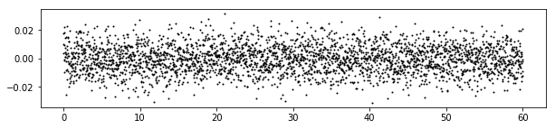
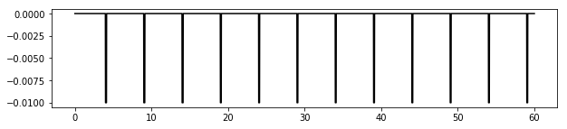
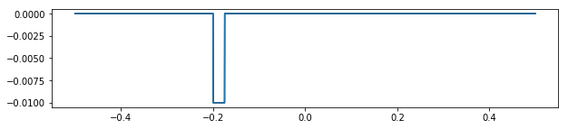
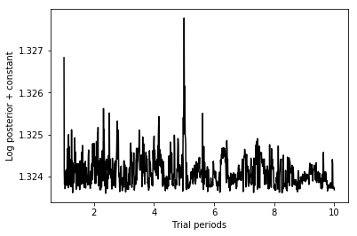
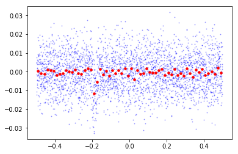
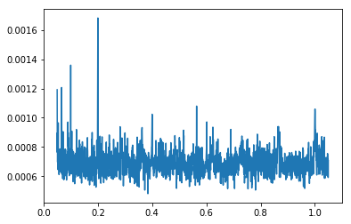

### Importing some slick packages


```python
%matplotlib inline
import matplotlib.pyplot as plt
import numpy as np
from lightkurve.lightcurve import fast_box_period_search, LightCurve
```

### Defining our sweet box function


```python
def box(time, amplitude, depth, to, width):
    val = np.zeros(len(time))
    out_of_transit = (time < to) + (time >= to + width)
    in_transit = np.logical_not(out_of_transit)
    val[out_of_transit] = amplitude
    val[in_transit] = amplitude - depth
    return val
```

### Parameters provided in the BLS paper


```python
t = np.linspace(0, 60, 3000) # time measurements
```


```python
transit_depth = sigma = 0.01 # transit depth and noise
```


```python
period = 5
```


```python
w = period * 0.025 # transit duration
```


```python
np.random.seed(0) # reproducibility
noise = sigma * np.random.normal(size=3000) # iid N(0, sigma**2) noise
```


```python
# for good measure, let's take a look at our noise
plt.figure(figsize=[10, 2])
plt.plot(t, noise, 'ok', markersize=1)
```





### Generating a transit signal with the box function


```python
transit_signal = np.zeros(3000)
for n in range((3000 // period)):
    transit_signal += box(t, 0., transit_depth, (n-.2) * period, w)
```


```python
plt.figure(figsize=[10, 2])
plt.plot(t, transit_signal, 'k')
```





Let's fold this signal:


```python
folded_signal = LightCurve(t, transit_signal).fold(period=period)
```


```python
plt.figure(figsize=[10, 2])
plt.plot(folded_signal.time, folded_signal.flux, 'k')
plt.plot(folded_signal.time, box(folded_signal.time, 0., transit_depth, -.2, 0.025))
```





Nice!

### Summing up noise and signal


```python
measured_signal = transit_signal + noise
```


```python
plt.figure(figsize=[10, 2])
plt.plot(t, measured_signal, 'ok', markersize=1)
```


Can you see the transit signal here? :o

### The actual search

Let's encapsulate the `measured_signal` into a LightCurve object:


```python
lc = LightCurve(t, measured_signal)
```

Run:


```python
logp, periods, bestperiod = fast_box_period_search(lc, min_period=1., max_period=10., nperiods=1000,
                                                    period_scale='linear')
```

      0%|          | 0/1000 [00:00<?, ?it/s]/Users/jvmirca/anaconda3/lib/python3.6/site-packages/scipy/optimize/optimize.py:1850: RuntimeWarning: invalid value encountered in double_scalars
      tmp2 = (x - v) * (fx - fw)
    /Users/jvmirca/anaconda3/lib/python3.6/site-packages/scipy/optimize/optimize.py:1851: RuntimeWarning: invalid value encountered in double_scalars
      p = (x - v) * tmp2 - (x - w) * tmp1
    100%|██████████| 1000/1000 [01:00<00:00, 16.67it/s]


```python
bestperiod
```


    5.0


```python
plt.plot(periods, logp, 'k')
plt.xlabel("Trial periods")
plt.ylabel("Log posterior + constant")
```





```python
fold = lc.fold(bestperiod)
```


```python
binned = fold.bin(binsize=50, method='mean')
```


```python
plt.plot(fold.time, fold.flux, 'bo', markersize=1, alpha=.3)
plt.plot(binned.time, binned.flux, 'ro', markersize=3.5)
```





:tada:!!


```python
import bls
nf, fmin, df = 2000, 0.05, 0.0005
results = bls.eebls(lc.time, lc.flux, np.empty(lc.time.shape),
                    np.empty(lc.time.shape), nf=nf, fmin=fmin, df=df, nb=1000, qmi=1e-3, qma=.2)
power, best_period, best_power, depth, q, in1, in2 = results
plt.plot(np.arange(fmin, fmin+nf*df, df), power)
```





```python
best_period
```


    5.0


### Conclusions: use eebls, it's faster and better.
