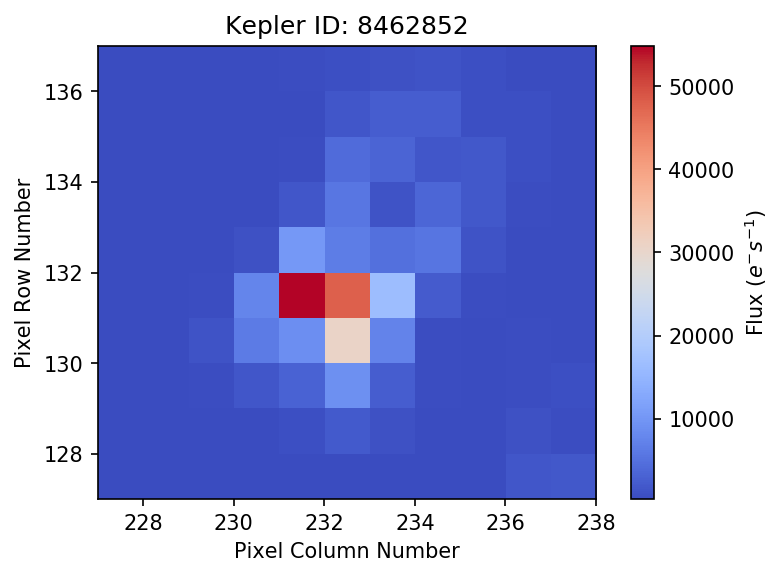
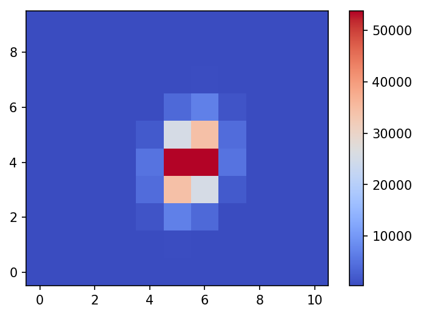
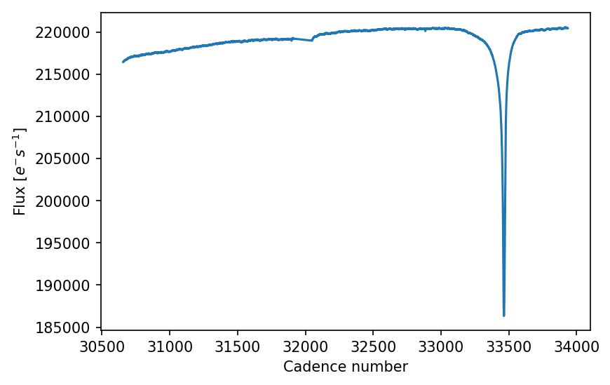
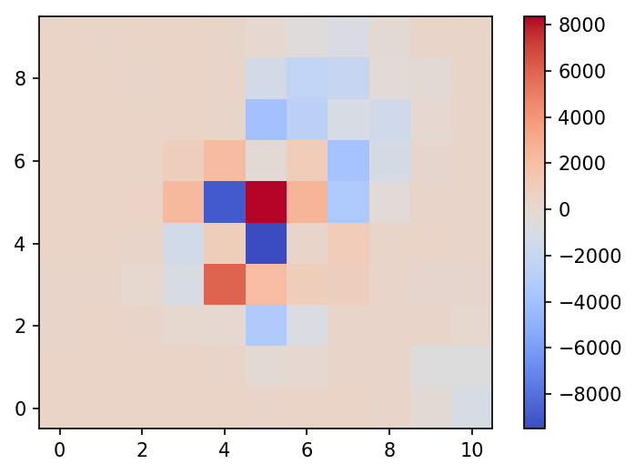

In this notebook I will show the steps of fitting a two dimensional
Gaussian, which is clearly a wrong model for NASA's Kepler point
spread function (PSF), to the image time series of KIC 8462852,
aka Tabby's or Boyajian's star.


```python
%matplotlib inline
%config IPython.matplotlib.backend = "retina"
import matplotlib.pyplot as plt
from matplotlib import rcParams
rcParams["figure.dpi"] = 150
rcParams["savefig.dpi"] = 150
rcParams['text.usetex'] = False
```

## Load libraries


```python
import tensorflow as tf
import numpy as np
from tqdm import tqdm
from lightkurve import KeplerTargetPixelFile
```

## Build a (wrong) model


```python
class Gaussian2D:
    def __init__(self, x, y):
        self.x = x
        self.y = y
        self.n_pixels = self.x.shape[0] * self.x.shape[1]
        if self.x.shape != self.y.shape:
            raise ValueError("Grid coordinates have the wrong shapes. Got {} and {}".
                             format(self.x.shape, self.y.shape))

    def __call__(self, *params):
        return self.evaluate(*params)

    def evaluate(self, A, xo, yo, a, b, c, B):
        p = tf.exp(-(a * (self.x - xo) ** 2
                     + 2 * b * (self.x - xo) * (self.y - yo)
                     + c * (self.y - yo) ** 2))
        p_sum = tf.reduce_sum(p)
        return A * p / p_sum + B
```

## Query data


```python
tabby = KeplerTargetPixelFile.from_archive(8462852, quarter=8)
```

    INFO: Found cached file ./mastDownload/Kepler/kplr008462852_lc_Q111111111111111111/kplr008462852-2011073133259_lpd-targ.fits.gz with expected size 6000827. [astroquery.query]


## Inspect data


```python
tabby.plot(scale=None, bkg=True, cmap='coolwarm')
```





```python
tabby.shape
```


    (3113, 10, 11)


## Create a coordinate grid to initialize the (wrong) model


```python
col_ref, row_ref = tabby.column, tabby.row
y, x = np.mgrid[row_ref:row_ref+tabby.shape[-2]-1:tabby.shape[-2]*1j,
                col_ref:col_ref+tabby.shape[-1]-1:tabby.shape[-1]*1j]
```


```python
y.shape, x.shape
```


    ((10, 11), (10, 11))


```python
gauss2D = Gaussian2D(x, y)
```


```python
sess = tf.Session()
sess.run(fetches=tf.global_variables_initializer())
```


```python
plt.imshow(sess.run(gauss2D(np.sum(tabby.flux[0]),
                            col_ref+5.5, row_ref+4, 1.2, -.15, .6, np.mean(tabby.flux_bkg[0]))),
           origin='lower', cmap='coolwarm')
plt.colorbar()
```





## Initialize the parameters to be estimated


```python
flux = tf.Variable(np.sum(tabby.flux[0]),
                   dtype=tf.float64, name='flux')
col = tf.Variable(col_ref+5.5, dtype=tf.float64, name='col')
row = tf.Variable(row_ref+4, dtype=tf.float64, name='row')
a = tf.Variable(1.2, dtype=tf.float64, name='a')
b = tf.Variable(-.15, dtype=tf.float64, name='b')
c = tf.Variable(.6, dtype=tf.float64, name='c')
bkg = tf.Variable(np.mean(tabby.flux_bkg[0]), dtype=tf.float64, name='bkg')
```


```python
mean = gauss2D(flux, col, row, a, b, c, bkg)
```


```python
sess.run(fetches=tf.global_variables_initializer())
plt.imshow(sess.run(mean), origin='lower', cmap='coolwarm')
plt.colorbar()
```


## Code the Poisson likelihood


```python
f = tf.placeholder(dtype=tf.float64)
# Poisson likelihood
negloglike = tf.reduce_sum(tf.subtract(mean, tf.multiply(f, tf.log(mean))))
```


```python
grad = tf.gradients(negloglike, [flux, col, row, a, b, c, bkg])
```


```python
sess = tf.Session()
sess.run(fetches=tf.global_variables_initializer())
```


```python
sess.run(negloglike, feed_dict={f: tabby.flux[0] + tabby.flux_bkg[0]})
```


    -2316716.4417710174


## Estimate parameters for every cadence


```python
opt_params = []
opt_grad = []
optimizer = tf.contrib.opt.ScipyOptimizerInterface(loss=negloglike,
                                                   var_list=[flux, col, row, a, b, c, bkg],
                                                   method='BFGS')
for n in tqdm(range(tabby.shape[0])):
    optimizer.minimize(session=sess, feed_dict={f: tabby.flux[n] + tabby.flux_bkg[n]})
    opt_params.append([sess.run(flux), sess.run(col), sess.run(row),
                       sess.run(a), sess.run(b), sess.run(c), sess.run(bkg)])
    opt_grad.append(sess.run(grad, feed_dict={f: tabby.flux[n] + tabby.flux_bkg[n]}))
```

   100%|██████████| 3113/3113 [05:17<00:00,  9.81it/s]


```python
opt_params = np.asarray(opt_params)
opt_grad = np.asarray(opt_grad)
```

## PSF photometry (wrong model) lightcurve


```python
plt.plot(tabby.cadenceno, opt_params[:, 0])
plt.ylabel(r"Flux $[e^{-}s^{-1}]$")
plt.xlabel(r"Cadence number")
```





## Residuals


```python
plt.imshow((sess.run(mean) - (tabby.flux[-1] + tabby.flux_bkg[-1])), cmap='coolwarm', origin='lower')
plt.colorbar()
```





## Remarks:

1. I think a better model (like a data-driven one) will improve results.
2. Many optimization steps ended with **"Desired error not necessarily achieved due to precision loss"**,
which is not pleasant. Maybe other optimization techniques should be investigated?

*"All models are wrong, but some are useful" (G. P. Box)*
