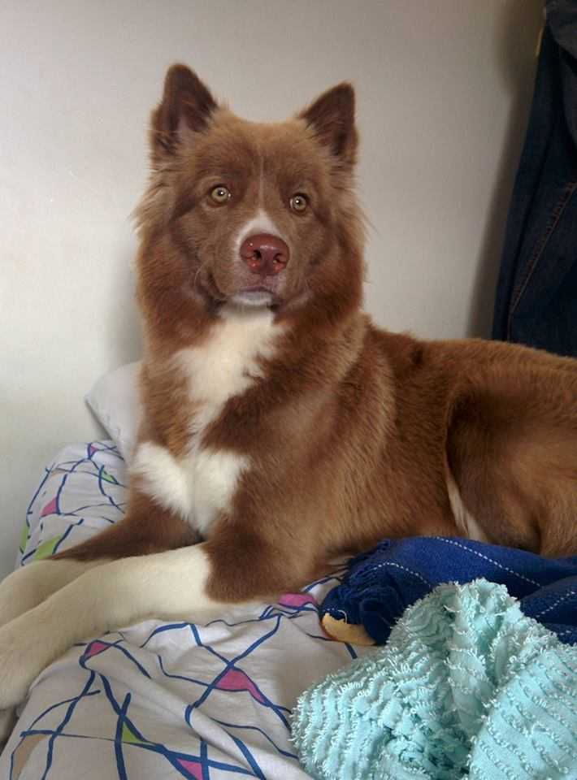

Hi there, my name is <b>Zé</b>!
  
I'm an undergraduate student majoring in Electrical Engineering at the Federal University of
Campina Grande, Brazil. Since my second semester in college I'm affiliated with the
<a href="https://www.iecom.org.br">Institute for Advanced Studies in Communications</a> mentored by
<a href="https://scholar.google.com.br/citations?user=NBSmPdAAAAAJ&hl=en">Dr. Marcelo Alencar</a>.

In 2014, I was awarded a Brazilian Scientific Mobility Program scholarship to study one year abroad
in The Catholic University of America, Washington DC, USA. In that opportunity, I took a variety
of classes among which my favorites were Stochastic Processes, Random Signal Theory, Information
Theory, and Estimation and Detection Theory which are at the core of Machine Learning and
Probabilistic algorithms.

In the Summer of 2015, I had the privilege to be an undergraduate guest researcher at the
Nanofabrication Research Group, National Institute of Standards and Technology, USA, under
the mentorship of
<a href="https://www.nist.gov/people/marcelo-davanco">Dr. Marcelo Davanço</a>.
In that opportunity, I was able to apply the theory
I learnt to implement routines in MATLAB for single molecule localization microscopy and
fluorescense localization imaging microscopy.
More precisely, I developed Maximum Likelihood Estimators (along with Fisher Information Matrices)
to localize and measure the brightness of nanoemitters (aka Point Spread Function photometry, in the
astronomy community). This work was part of bigger projects which were later published
on <a href="https://www.nature.com/articles/s41467-017-00987-6.pdf"><i>Nature Communications</i></a>
and <a href="http://aip.scitation.org/doi/full/10.1063/1.4976578"><i>Review of Scientific Instruments</i></a>.

In the Spring of 2016 I went back to school in Brazil and got an undergraduate teaching assistant
scholarship for the course of Probability and Statistics for Electrical Engineering and
Computer Science. Besides helping students understand basics concepts of probability theory
during office hours, I also gave weekly lectures during which I solved exercises together with
the students.

During the Summer of 2016 I took a gap semester in my undergraduate studies to become a student
software developer for the Astropy Project as part of the Google Summer of Code program.
In that occasion, I developed Python code to perform both unsupervised clustering and regression
of Gaussian Mixture Models for Point Spread Function photometry. I had the privilege to be
mentored by
<a href="http://space.mit.edu/~guenther/">Dr. Hans Moritz Gunther</a>,
<a href="https://github.com/bsipocz">Dr. Brigitta Sipocz</a>, and
<a href="http://www.stsci.edu/~etollerud/">Dr. Erik Tollerud</a>.

Beginning 2017, I started as an intern for the K2 Mission at NASA Ames,
in Silicon Valley, USA, working on data analysis problems together with
<a href="http://geert.io">Dr. Geert Barentsen</a>,
<a href="http://gully.github.io">Dr. Michael Gully-Santiago</a>,
<a href="https://christinasupportsscience.blogspot.com">Dr. Christina Hedges</a>,
and
<a href="http://annmariecody.com">Dr. Ann Marie Cody</a>.

In my spare time, I enjoy taking my dog Pluto for a walk, drinking
a good coffee, playing football, writing code for open source projects,
playing chess, and reading books.

<i>Fun fact</i>: I was featured IEEE Student of the Week in the
<a href="https://www.facebook.com/IEEEStudents/photos/a.285696968155912.70076.236454509746825/769475893111348/?type=1&theater">IEEE Students Facebook webpage</a>. \o/

If you read til here, enjoy a photo of Pluto ;-):
 

